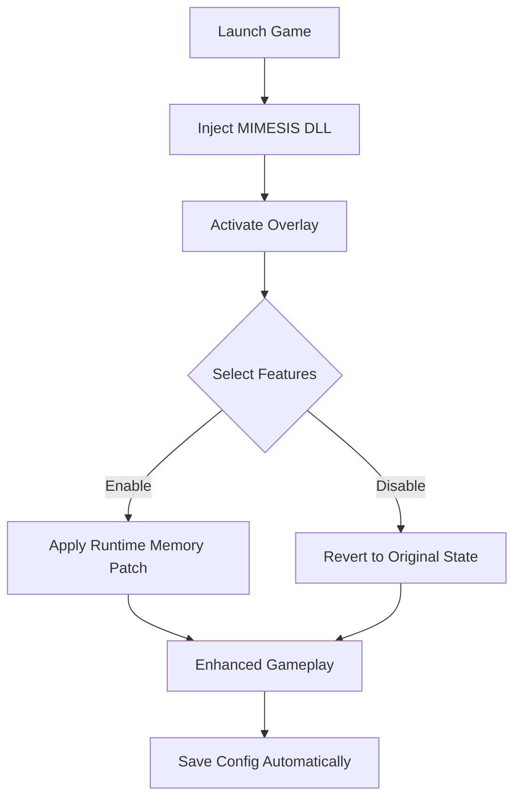

# 🧬 MIMESIS Mod Menu Overview

The **MIMESIS Mod Menu** transforms standard gameplay into a fully customizable experience. Designed for users who value precision, freedom, and control, this tool integrates directly into your game environment—letting you activate enhancements, tweak in-game variables, and dominate with limitless performance.

From infinite ammo to unbreakable gear, MIMESIS gives you *developer-level access* with a polished, user-friendly overlay.

---

## ⚙️ Core Features

**Unlimited Resources**

* 🔫 *Infinite Ammo* – Never reload mid-fight again.
* 🪓 *Durability Lock* – Weapons and tools remain pristine, forever.
* 💰 *Unlimited Currency* – Upgrade instantly and expand without limits.

**Advanced Menu Interface**

* Sleek, minimal overlay with hotkey access (`F8` default).
* Configurable panels for weapons, player stats, and world modifiers.
* Custom theme options for dark/light UI environments.

**Performance & Security**

* Built with low-level injection safeguards.
* Optimized for minimal CPU and GPU overhead.
* Stealth hooks prevent interference with gameplay or frame rate.

---

## 🧩 Compatibility Table

| Platform      | Supported  | Notes                          |
| ------------- | ---------- | ------------------------------ |
| Windows 10/11 | ✅          | Native injector & overlay      |
| Steam         | ✅          | Full compatibility             |
| Epic Games    | ✅          | Requires manual launch path    |
| Gamepad Input | ⚙️ Partial | Menu navigation via D-Pad only |

> [!NOTE]
> To ensure optimal stability, launch the mod after the main menu loads. Avoid using during cinematic sequences for best results.

---

## 🚀 Setup Guide

Follow these steps to activate the **MIMESIS Mod Menu** quickly:

1. **Extract** the downloaded `.zip` archive into your game directory.
2. **Run** the launcher as Administrator.
3. **Bind** your toggle hotkey (default: `Insert`).
4. **Select Modules** like Ammo, Currency, or Durability in the overlay.
5. **Play normally** — your modifications apply in real time.

Example configuration snippet:

```ini
[Player]
InfiniteAmmo=True
InfiniteDurability=True
MaxCurrency=9999999

[Hotkeys]
ToggleMenu=Insert
QuickSave=F6
```

---

## 🧠 Workflow Diagram



---

## 💡 Frequently Asked Questions

### 🧩 1. Is MIMESIS safe to use?

Yes. The mod menu uses isolated memory patches and never modifies permanent game files.

### 🎮 2. Can I use it online?

MIMESIS is primarily built for **offline or private sessions**. Use caution in online modes.

### ⚙️ 3. Does it support updates automatically?

Yes — the loader checks for build updates on launch and adjusts offsets dynamically.

### 🧰 4. Can I customize hotkeys and visuals?

Absolutely. Every module can be remapped, resized, or restyled from the `config.ini`.

### 💾 5. Where are configs saved?

Configs are stored in `Documents\MIMESIS\Profiles\Default.cfg`, allowing easy backup or sharing.

---

## 🔒 Additional Notes

> [!IMPORTANT]
> Avoid combining multiple trainers with MIMESIS simultaneously. Overlapping memory hooks can cause instability or crash loops.

---

## 🏁 Final Thoughts

The **MIMESIS Mod Menu** stands out as a refined control suite for players who want more than default gameplay limits. Whether you’re experimenting, speed-running, or just exploring without constraints — this tool gives you the power to shape your game exactly how you want.

---

**MIMESIS Mod Menu** — precision, persistence, and power combined.
